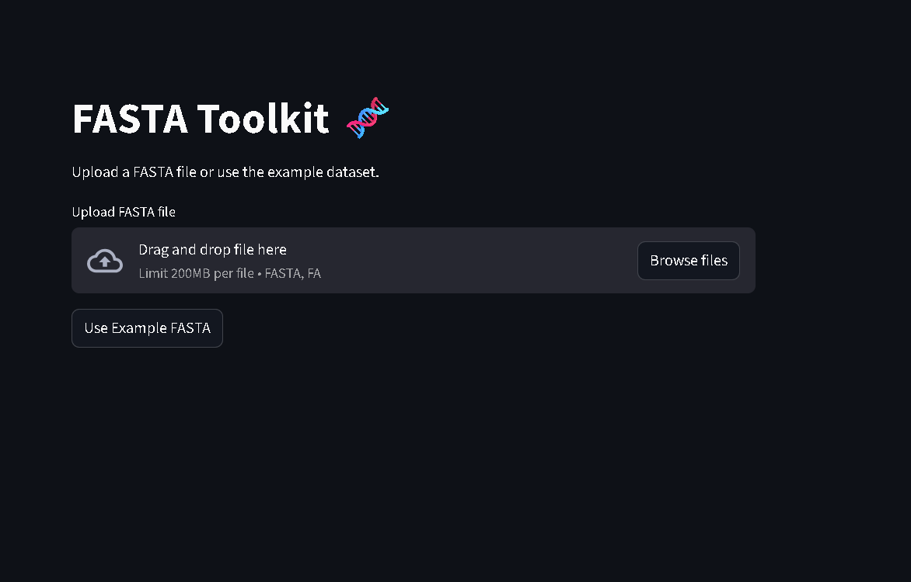

# FASTA Toolkit 🧬


A lightweight **bioinformatics toolkit built with Python and Streamlit** for analyzing DNA sequences from FASTA files.

The toolkit allows researchers, students, and developers to perform **common DNA sequence analysis tasks quickly through an interactive web interface**.

---

# 🌐 Live Demo

🚀 **Try the application online**

👉 fasta-toolkit-hefppy6xxdky5r2qqnwljk


---

# 📸 Application Preview



---

# 🚀 Features

## 📂 FASTA File Processing

* Upload FASTA files
* Parse multiple sequences
* Select sequences interactively

## 🧪 Sequence Analysis Tools

* Sequence length calculation
* GC content calculation
* DNA → RNA transcription
* Reverse complement generation
* DNA → Protein translation

## 🔍 Pattern Analysis

* **Motif Finder**
  Search specific DNA motifs within sequences.

* **ORF Finder**
  Detect potential open reading frames that may represent genes.

## 📊 Visualization

* GC content histogram
* GC content comparison bar chart

## 📥 Data Export

* Download GC content analysis as CSV

---

# 🧬 Example FASTA File

A sample FASTA file is included in the repository.

`sample.fasta`

```
>Human_gene_example
ATGCGTACGATCGATCGATCGTAGCTAGCTAGCTAGCTAGCTAA

>Mouse_gene_example
ATGCGTATATATCGCGCGCGATATATATCGCGCGCGCTGA
```

---

# 🛠 Technologies Used

| Technology | Purpose                     |
| ---------- | --------------------------- |
| Python     | Core programming language   |
| Streamlit  | Interactive web application |
| Pandas     | Data handling               |
| Matplotlib | Data visualization          |

---

# 📦 Installation

Clone the repository:

```
git clone https://github.com/shahvansh1506/FASTA-toolkit.git
```

Navigate to the project folder:

```
cd FASTA-toolkit
```

Install dependencies:

```
python -m pip install -r requirements.txt
```

---

# ▶ Running the Web Application

Run the Streamlit app:

```
streamlit run app.py
```

If Streamlit is not recognized:

```
python -m streamlit run app.py
```

The application will open at:

```
http://localhost:8501
```

---

# 🖥 Command Line Version

You can also run the command-line analysis tool:

```
python main.py
```

This will analyze sequences directly in the terminal.

---

# 📁 Project Structure

```
FASTA-toolkit
│
├── screenshots
│      └── demo.png
│
├── sample.fasta
│
├── app.py              # Streamlit web application
├── main.py             # Command-line FASTA analyzer
├── utils.py            # Core bioinformatics functions
│
├── requirements.txt    # Python dependencies
└── README.md
```

---

# 📊 Toolkit Capabilities

| Tool               | Description                         |
| ------------------ | ----------------------------------- |
| FASTA Reader       | Parses multi-sequence FASTA files   |
| GC Content         | Calculates GC percentage            |
| DNA → RNA          | Converts DNA to RNA                 |
| Reverse Complement | Generates complementary DNA strand  |
| DNA Translation    | Converts DNA to protein sequence    |
| Motif Finder       | Detects DNA motifs                  |
| ORF Finder         | Identifies potential coding regions |
| GC Visualization   | Graphical GC content analysis       |

---

# 🎯 Purpose of the Project

This toolkit was created as a **bioinformatics learning and portfolio project** demonstrating:

* Biological sequence analysis
* Implementation of bioinformatics algorithms
* Scientific data visualization
* Development of interactive scientific web applications

---

# ⭐ Future Improvements

Planned upgrades:

* Sequence alignment (Needleman–Wunsch algorithm)
* Codon usage analysis
* ORF visualization
* Multi-sequence comparison
* Genome browser style visualization

---

# 👨‍💻 Author

**Vansh Shah**

GitHub Profile
https://github.com/shahvansh1506

Project Repository
https://github.com/shahvansh1506/FASTA-toolkit

---

# 🤝 Contributing

Contributions are welcome.

If you'd like to improve the toolkit:

1. Fork the repository
2. Create a new branch
3. Commit your changes
4. Submit a pull request

---

# 📜 License

This project is licensed under the **MIT License**.
